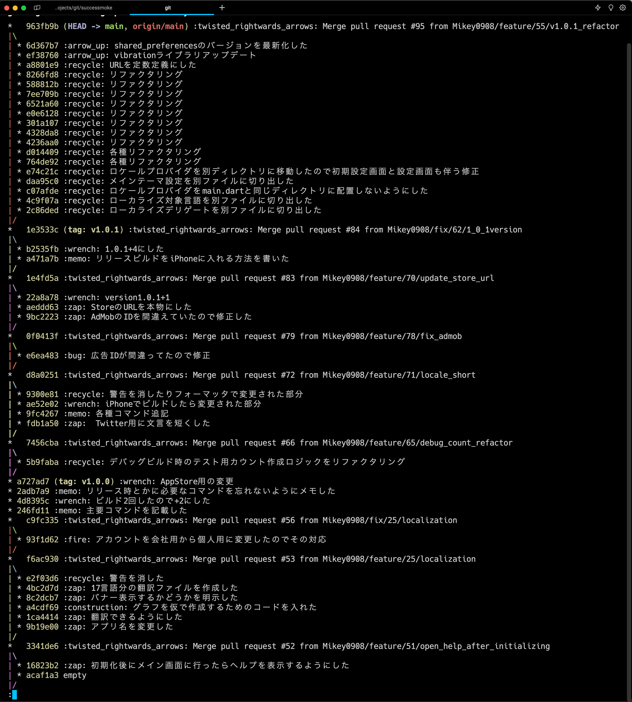
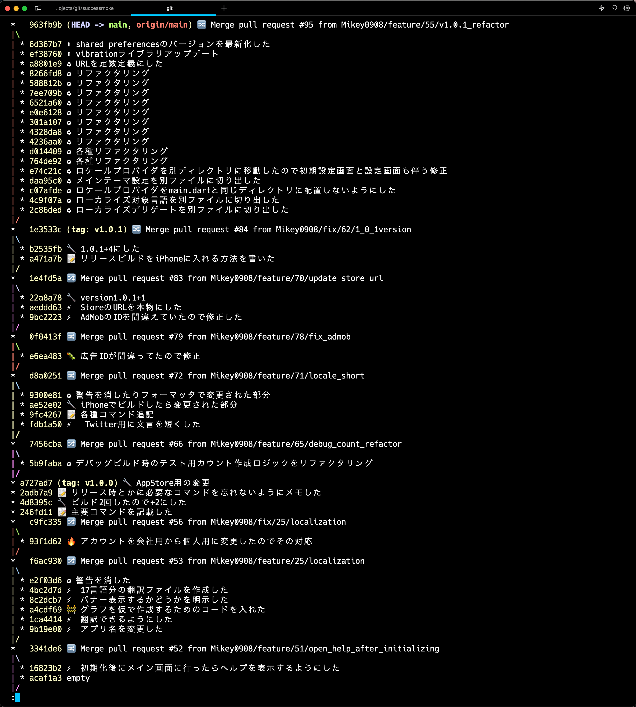

# About

git logでgitmojiを絵文字に変換して表示します。

# Demo

使用前



使用後



# Prepare

```bash
$ git clone git@github.com:Mikey0908/git-log-gitmoji.git
$ brew install python3
$ pip install color
$ pip install emoji
```


# Usage


{git-log-gitmojiをcloneした場所}を置き換えて使用してください。

```
$ git log --oneline --graph --color=always --decorate | python3 ~/{git-log-gitmojiをcloneした場所}/git-log-gitmoji/git-log-gitmoji.py | less -R
```

エイリアスを使うとより使いやすくなると思うのでお好みでつけましょう。

- ~/.bashrc or ~/.zshrc etc...

    ```
    :
    alias l='git log --oneline --graph --color=always --decorate | python3 ~/{git-log-gitmojiをcloneした場所}/git-log-gitmoji.py | less -R'
    alias la='git log --oneline --all --graph --color=always --decorate | python3 ~/{git-log-gitmojiをcloneした場所}/git-log-gitmoji.py | less -R'
    :
    ```

# Explain

git logで実行した結果をpythonで変換し、出力しています。
